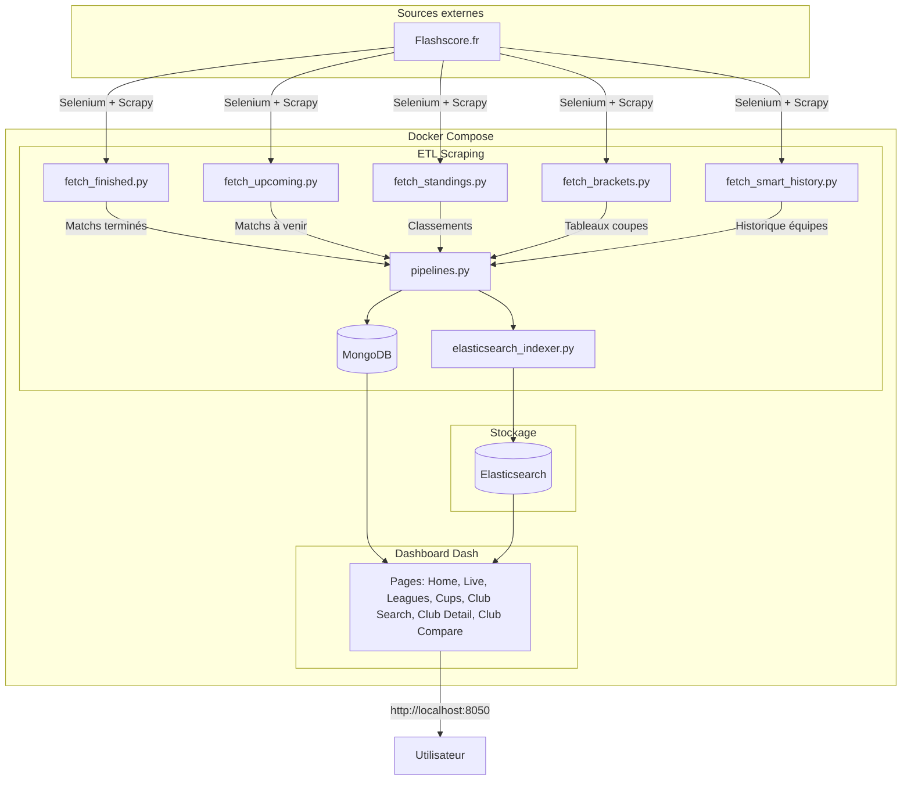

# Flashscore Football Dashboard

*Projet de Data Engineering - ESIEE Paris (2025/2026)*

## Présentation

Dashboard interactif pour l'analyse et la visualisation de données footballistiques en temps réel. Cette application collecte automatiquement les informations de matchs depuis [Flashscore.fr](https://www.flashscore.fr/) et les présente via une interface web moderne.

**Objectifs du projet :**
- Automatiser la collecte de données footballistiques (web scraping)
- Implémenter un pipeline ETL avec stockage NoSQL et recherche full-text
- Développer une application de visualisation interactive
- Manipuler des données temps réel avec rafraîchissement automatique

**Fonctionnalités clés :**
- Suivi des matchs en cours avec scores actualisés
- Classements de ligues avec statistiques avancées
- Moteur de recherche intelligent pour les clubs
- Comparaison détaillée entre équipes
- Visualisation des tableaux de compétitions à élimination

---

## Démarrage rapide

### Prérequis
- Docker & Docker Compose installés
- Minimum 4 Go de RAM disponible pour Docker
- Connexion Internet stable

### Installation

```bash
git clone <url-du-repo>
cd Projet_Data_Engineering
docker-compose up -d
```

**Accès :** http://localhost:8050

**Premier lancement :** L'initialisation automatique collecte les données depuis Flashscore (3-10 minutes selon la connexion). Pour bénéficier d'un échantillon conséquent, attendez environ 20 minutes avant d'explorer toutes les fonctionnalités.

### Nettoyage complet

```bash
docker-compose down -v  # Supprime containers + volumes
docker-compose up -d --build  # Reconstruit tout
```

---

## Utilisation

### Supervision du système

**Suivre l'initialisation :**
```bash
docker-compose logs -f scrapy
```

**Logs de l'application :**
```bash
docker-compose logs -f webapp
```

**État du système :**
```bash
docker exec flashscore-scrapy python /app/check_status.py
```

### Gestion des données

**Relancer les scrapers manuellement :**
```bash
# Matchs terminés
docker exec flashscore-scrapy python /app/crawler/fetch_finished.py

# Matchs à venir
docker exec flashscore-scrapy python /app/crawler/fetch_upcoming.py

# Classements
docker exec flashscore-scrapy python /app/crawler/fetch_standings.py
```

**Accès direct à MongoDB :**
```bash
docker exec -it mongodb mongosh
use flashscore_db
db.matches.countDocuments()
```

### Maintenance

```bash
docker-compose restart webapp    # Redémarrer l'application
docker-compose restart scrapy    # Redémarrer le scraper
docker-compose down              # Arrêter tous les services
```

---

## Architecture technique

### Stack technologique

| Composant | Technologie | Rôle |
|-----------|-------------|------|
| **Scraping** | Scrapy + Selenium | Collecte des données Flashscore |
| **Base de données** | MongoDB 7.0 | Stockage NoSQL des matchs et statistiques |
| **Recherche** | Elasticsearch 8.11 | Indexation et recherche fuzzy des clubs |
| **Visualisation** | Dash/Plotly | Interface web interactive |
| **Orchestration** | Docker Compose | Déploiement multi-conteneurs |

## Structure du projet

```
Projet_Data_Engineering/
│
├── docker-compose.yml          Orchestration des 4 services (MongoDB, Elasticsearch, Scrapy, Webapp)
├── README.md                   Documentation principale
│
├── Scrapy/                     Container de scraping
│   ├── Dockerfile              Image Python pour le scraper
│   ├── entrypoint.sh           Script d'initialisation automatique
│   ├── requirements.txt        Dépendances Python (Scrapy, Selenium, pymongo)
│   ├── scrapy.cfg              Configuration Scrapy
│   │
│   └── crawler/
│       ├── fetch_finished.py        Scraper matchs terminés
│       ├── fetch_upcoming.py        Scraper matchs à venir
│       ├── fetch_standings.py       Scraper classements des ligues
│       ├── fetch_brackets.py        Scraper tableaux de coupes
│       ├── fetch_smart_history.py   Scraper historique des équipes
│       ├── flashscore_feed.py       Parser de feed Flashscore
│       ├── pipelines.py             Pipeline MongoDB
│       ├── settings.py              Configuration Scrapy
│       ├── selenium_utils.py        Utilitaires Selenium
│       ├── setup_mongodb.py         Initialisation MongoDB
│       ├── initialization_tracker.py Suivi de l'initialisation
│       └── trigger_elasticsearch.py  Indexation Elasticsearch
│
└── Webapp/                     Container application web
    ├── Dockerfile              Image Python pour Dash
    ├── requirements.txt        Dépendances Python (Dash, Plotly, pymongo)
    │
    └── app/
        ├── main.py                  Point d'entrée Dash
        ├── database.py              Module MongoDB
        ├── elasticsearch_indexer.py Indexation des clubs
        ├── check_rounds.py          Vérification des tours de coupe
        ├── text_utils.py            Utilitaires de texte
        │
        ├── components/
        │   └── navbar.py            Barre de navigation
        │
        ├── pages/
        │   ├── home.py              Page d'accueil
        │   ├── live.py              Matchs en direct
        │   ├── leagues.py           Liste des ligues
        │   ├── league_detail.py     Détail d'une ligue
        │   ├── cups.py              Tableaux de coupes
        │   ├── club_search.py       Recherche de clubs
        │   ├── club_detail.py       Détails d'un club
        │   ├── club_compare.py      Comparaison de clubs
        │   └── loading.py           Page de chargement
        │
        └── assets/
            ├── style.css            Styles globaux
            ├── club_styles.css      Styles page clubs
            ├── brackets_styles.css  Styles tableaux de coupes
            └── brackets_init.js     Initialisation tableaux
```

## Architecture



### Composants clés

#### Scrapers (5 modules spécialisés)

| Module | Cible | Fréquence |
|--------|-------|-----------|
| `fetch_finished.py` | Matchs terminés | Init + manuel |
| `fetch_upcoming.py` | Matchs à venir | Init + manuel |
| `fetch_standings.py` | Classements ligues | Init + manuel |
| `fetch_brackets.py` | Tableaux coupes | Init + manuel |
| `fetch_smart_history.py` | Historique équipes | Init + manuel |

#### Pipeline ETL

- **Extraction** : Selenium ouvre les pages JavaScript de Flashscore
- **Transformation** : `pipelines.py` normalise et déduplique les données
- **Loading** : Insertion MongoDB + indexation Elasticsearch

#### Dashboard (8 pages interactives)

1. **Accueil** : Présentation + vidéo démo
2. **Live** : Matchs en cours (refresh 60s)
3. **Ligues** : Liste des compétitions
4. **Détail ligue** : Classement + statistiques
5. **Coupes** : Tableaux à élimination
6. **Recherche** : Moteur fuzzy pour clubs
7. **Détail club** : Stats + historique
8. **Comparaison** : Analyse comparative 2 clubs

---

## Modèle de données

---

## Modèle de données

### MongoDB Collections

#### Collection `matches`
Stocke tous les matchs (terminés, à venir, en direct).

| Champ | Type | Description |
|-------|------|-------------|
| match_id | String (PK) | Identifiant unique Flashscore |
| home_team, away_team | String | Noms des équipes |
| home_score, away_score | Integer | Scores finaux |
| status | Enum | finished / upcoming / live |
| date, time | String | DD.MM.YYYY, HH:MM |
| league, country | String | Compétition et pays |
| home_logo, away_logo | String | URLs des logos |
| scraped_at | DateTime | Horodatage collecte |

#### Collection `standings`
Classements des ligues avec statistiques détaillées.

| Champ | Type | Description |
|-------|------|-------------|
| league, country, season | String | Identifiant de la compétition |
| team_name | String | Nom de l'équipe |
| position, points | Integer | Classement et score |
| played, wins, draws, losses | Integer | Statistiques de matchs |
| goals_for, goals_against | Integer | Buts marqués/encaissés |
| goal_difference | Integer | Différence de buts |
| form | String | Ex: "WDLWW" (5 derniers matchs) |
| scraped_at | DateTime | Horodatage collecte |

#### Collection `brackets`
Tableaux à élimination directe des coupes.

| Champ | Type | Description |
|-------|------|-------------|
| competition | String | Nom de la coupe |
| round | String | Final, Semi-finals, etc. |
| match_id | String | Référence au match |
| home/away_team, scores | Mixed | Infos match |
| date, status | String | Timing |

#### Collection `initialization_tracker`
Suivi de l'état du système.

| Champ | Type | Description |
|-------|------|-------------|
| status | Enum | in_progress / completed |
| steps_completed | Array | Liste des scrapers terminés |
| last_update | DateTime | Dernière modification |

### Elasticsearch Index

#### Index `clubs`
Recherche full-text avec fuzzy matching.

| Champ | Type | Analyseur |
|-------|------|-----------|
| name | Text | Standard + fuzzy |
| country, league | Keyword | Exact match |
| matches_count | Integer | - |
| wins, draws, losses | Integer | - |
| goals_for, goals_against | Integer | - |
| last_updated | Date | - |

**Configuration fuzzy :** `fuzziness: "AUTO"` tolère 1-2 caractères erronés selon la longueur du mot.

---

## Configuration système

---

## Configuration système

### Variables d'environnement

| Variable | Valeur par défaut | Usage |
|----------|-------------------|-------|
| MONGO_URI | `mongodb://mongodb:27017/` | Connexion MongoDB |
| MONGO_DB | `flashscore_db` | Nom de la base |
| ELASTICSEARCH_URL | `http://elasticsearch:9200` | URL Elasticsearch |
| CHROME_DRIVER_PATH | `/usr/bin/chromedriver` | Selenium driver |

**En développement local :** Remplacer les noms de services par `localhost` et ajuster les ports.

### Services Docker

| Service | Port | Ressources | Rôle |
|---------|------|------------|------|
| mongodb | 27017 | - | Base NoSQL |
| elasticsearch | 9200 | 2 Go RAM min | Moteur de recherche |
| scrapy | - | - | Collecteur de données |
| webapp | 8050 | - | Interface web |

---

## Dépannage

### Problème : Page de chargement infinie

**Cause :** Le tracker d'initialisation est bloqué  
**Solution :**
```bash
docker exec flashscore-scrapy python /app/crawler/force_initialization_complete.py
docker-compose restart webapp
```

### Problème : Aucune donnée affichée

**Diagnostic :**
```bash
docker exec flashscore-scrapy python /app/check_status.py
docker-compose logs scrapy
```

**Actions :**
- Vérifier que MongoDB contient des documents : `db.matches.countDocuments()`
- Relancer les scrapers manuellement
- Vérifier la connexion Internet

### Problème : Elasticsearch ne démarre pas

**Cause :** Mémoire insuffisante  
**Solution :** Allouer minimum 4 Go de RAM à Docker Desktop (Préférences → Ressources)

### Problème : Logos manquants

**Cause :** URLs Flashscore expirées ou bloquées  
**Solution :** Relancer `fetch_finished.py` pour rafraîchir les URLs

### Problème : Erreur de connexion MongoDB

**Diagnostic :**
```bash
docker-compose ps  # Vérifier que mongodb est UP
docker logs mongodb  # Voir les erreurs
```

**Solution :**
- Recréer les volumes : `docker-compose down -v && docker-compose up -d`
- Vérifier les permissions du dossier de données

---

## Description des pages

---

## Description des pages

### Page d'accueil `/`

Vitrine du projet présentant le contexte, les objectifs et la stack technique. Intègre une vidéo de démonstration complète du dashboard pour permettre une découverte rapide des fonctionnalités.

**Vidéo de démonstration :** [Media/presentation.mp4](Media/presentation.mp4)

**Contenu :**
- Présentation du projet et contexte académique
- Technologies utilisées (MongoDB, Elasticsearch, Scrapy, Dash)
- Vidéo démo intégrée (également disponible dans le dossier Media)
- Liens de navigation vers toutes les sections

---

### Matchs en direct `/live`

Affichage temps réel des matchs en cours avec rafraîchissement automatique (intervalle : 60 secondes).

**Données affichées :**
- Scores actuels avec mise à jour live
- Temps de jeu (minutes jouées)
- Organisation par compétition
- Logos des équipes

**Technique :** Parse le feed JSON de Flashscore (`flashscore_feed.py`) pour obtenir les données en temps réel.

---

### Ligues `/leagues`

Vue d'ensemble de toutes les compétitions disponibles dans la base.

**Informations affichées :**
- Nom de la ligue/compétition
- Pays (avec drapeau)
- Nombre d'équipes participantes
- Lien vers le classement détaillé

**Interactivité :** Clic sur une ligue → redirection vers `/league-detail`

---

### Détail d'une ligue `/league-detail`

Classement complet d'une ligue avec toutes les statistiques officielles.

**Tableau de classement :**
- Position, équipe (avec logo), points
- Matchs joués, victoires, nuls, défaites
- Buts marqués/encaissés, différence de buts
- Forme récente (ex: WDWLW pour les 5 derniers matchs)

**Visualisations :**
- Graphique d'évolution des points (line chart)
- Indicateurs visuels (top 3 en vert, relégation en rouge)

---

### Tableaux de coupes `/cups`

Visualisation des phases à élimination directe des compétitions majeures (Champions League, World Cup, etc.).

**Fonctionnalités :**
- Arbre interactif des matchs par tour
- Organisation : Finale → Demi-finales → Quarts → Huitièmes
- Affichage des scores et dates
- Support de multiples compétitions

**Rendu :** Utilise `brackets_init.js` et `brackets_styles.css` pour créer les arbres graphiques.

---

### Recherche de clubs `/clubs/search`

Moteur de recherche intelligent avec tolérance aux fautes de frappe (Elasticsearch fuzzy matching).

**Fonctionnalités de recherche :**
- Recherche par nom de club
- Tolérance automatique aux erreurs (1-2 caractères)
- Résultats avec statistiques complètes :
  - Nombre de matchs, victoires, nuls, défaites
  - Buts marqués/encaissés
  - Taux de victoire (%)
  - Forme récente

**Visualisations :**
- Pie chart : répartition victoires/nuls/défaites
- Bar chart : buts marqués vs encaissés
- Lien vers page détail du club

---

### Détail d'un club `/clubs/detail`

Page complète dédiée à un club avec historique et statistiques avancées.

**Sections :**
1. **En-tête** : Logo, nom, pays, ligue
2. **Statistiques globales** : 
   - Total matchs, victoires (%), nuls (%), défaites (%)
   - Buts totaux marqués/encaissés
3. **Graphiques interactifs** :
   - Pie chart des résultats
   - Bar chart buts marqués/encaissés
   - Line chart évolution de la forme
   - Radar chart performance
4. **Derniers matchs** : Liste avec résultats et dates
5. **Prochains matchs** : Calendrier à venir

---

### Comparaison de clubs `/clubs/compare`

Analyse comparative de deux équipes côte à côte.

**Visualisations :**
- **Radar chart central** : Comparaison multi-critères
  - Victoires, défaites, buts marqués, buts encaissés, taux de victoire
- **Statistiques parallèles** : Tableau comparatif complet
- **Graphiques individuels** : Pie charts pour chaque club

**Fonctionnalité bonus :** Si disponible, affiche l'historique des confrontations directes entre les deux clubs.

---

## Références et ressources

---

## Références et ressources

| Type | Nom | Lien |
|------|-----|------|
| Source de données | Flashscore.fr | https://www.flashscore.fr/ |
| API temps réel | Flashscore Feed | https://www.flashscore.fr/x/feed/ |
| Scraping | Scrapy Docs | https://docs.scrapy.org/ |
| Automatisation web | Selenium Docs | https://www.selenium.dev/documentation/ |
| Base NoSQL | MongoDB Docs | https://www.mongodb.com/docs/ |
| Recherche | Elasticsearch Guide | https://www.elastic.co/guide/ |
| Visualisation | Dash/Plotly Docs | https://dash.plotly.com/ |

---

## Checklist des fonctionnalités

- [x] Scraping automatique au démarrage (entrypoint.sh)
- [x] Pipeline ETL avec déduplication MongoDB
- [x] Indexation Elasticsearch avec fuzzy search
- [x] Dashboard interactif multi-pages (8 pages)
- [x] Matchs en direct avec refresh automatique (60s)
- [x] Filtrage temporel (date/mois)
- [x] Graphiques interactifs Plotly
- [x] Logos et drapeaux des équipes
- [x] Interface responsive CSS
- [x] Recherche intelligente de clubs
- [x] Comparaison statistique entre équipes
- [x] Classements avec forme récente (WDLWW)
- [x] Tableaux à élimination (coupes)
- [x] Statistiques avancées par club
- [x] Gestion des erreurs et page loading
- [x] Dockerisation complète (4 conteneurs)

---

## Auteurs

Projet académique réalisé dans le cadre de l'UE **Data Engineering**  
ESIEE Paris - Année 2025/2026

---

*Documentation générée le 13/02/2026*
