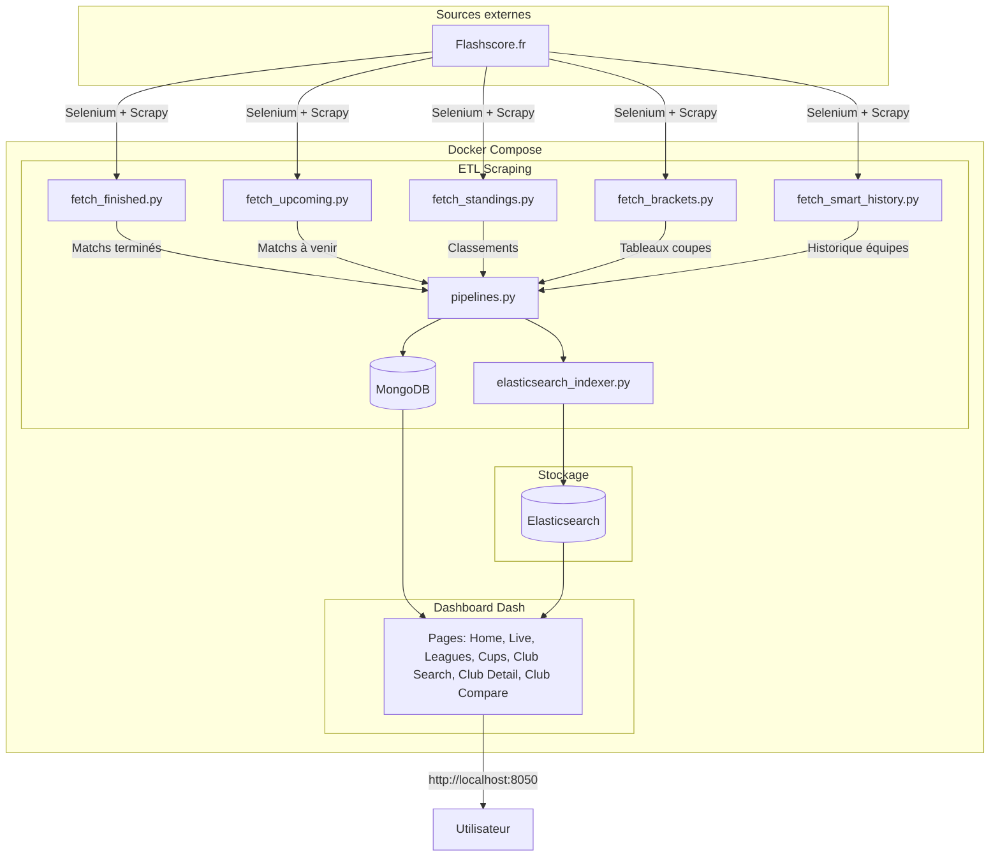

# Flashscore Football Dashboard : Analyse de Matchs de Football en Temps Réel

Projet réalisé dans le cadre de l'unité Data Engineering (2025/2026), ESIEE Paris.

Le football est l'un des sports les plus suivis au monde, mais les données de matchs restent souvent fragmentées et difficilement accessibles. Ce projet propose une application web complète qui scrape automatiquement les données de matchs depuis [Flashscore.fr](https://www.flashscore.fr/), les stocke dans MongoDB, les indexe dans Elasticsearch pour la recherche, et les restitue sous forme de dashboard interactif. L'utilisateur peut explorer les matchs terminés et à venir, consulter les classements des ligues, suivre les matchs en direct, rechercher des clubs spécifiques, comparer leurs performances, et visualiser les tableaux de coupes avec statistiques détaillées.

---

# Guide utilisateur

## Prérequis

Docker et Docker Compose installés sur la machine. Un minimum de 4 Go de RAM est recommandé. Une connexion internet stable est requise pour le scraping des données depuis Flashscore.fr.

## Installation et lancement

```bash
git clone <url-du-repo>
cd Projet_Data_Engineering
docker-compose up -d
```

L'application est ensuite accessible à l'adresse **http://localhost:8050**.

Au premier lancement, le scraping se lance automatiquement. Les données sont collectées depuis Flashscore.fr : matchs terminés, matchs à venir, classements des ligues, matchs en direct, et historique des équipes (**3 à 10 minutes** selon la disponibilité du site). Une fois l'initialisation terminée, le dashboard Dash est accessible. Pour obtenir un échantillon de données conséquent et exploiter pleinement toutes les fonctionnalités du dashboard, il est recommandé d'attendre environ **20 minutes** que le scraping collecte un volume significatif de matchs.

### Réinitialiser et relancer

Pour repartir de zéro (vider la base et relancer le scraping complet) :

```bash
docker-compose down -v
docker-compose up -d --build
```

La commande `down -v` supprime les containers et les volumes (base de données MongoDB, index Elasticsearch). La commande `up --build` reconstruit les images et relance l'ensemble du pipeline.

## Commandes utiles

Suivre l'initialisation automatique :

```bash
docker-compose logs -f scrapy
```

Voir les logs de l'application web :

```bash
docker-compose logs -f webapp
```

Relancer le scraping des matchs terminés :

```bash
docker exec flashscore-scrapy python /app/crawler/fetch_finished.py
```

Relancer le scraping des matchs à venir :

```bash
docker exec flashscore-scrapy python /app/crawler/fetch_upcoming.py
```

Relancer le scraping des classements :

```bash
docker exec flashscore-scrapy python /app/crawler/fetch_standings.py
```

Accéder directement à MongoDB :

```bash
docker exec -it mongodb mongosh
use flashscore_db
db.matches.countDocuments()
```

Vérifier l'état complet du projet :

```bash
docker exec flashscore-scrapy python /app/check_status.py
```

Relancer un service spécifique :

```bash
docker-compose restart scrapy
docker-compose restart webapp
```

Arrêter tous les services :

```bash
docker-compose down
```

---

# Guide développeur

## Structure du projet

```
Projet_Data_Engineering/
│
├── docker-compose.yml          Orchestration des 4 services (MongoDB, Elasticsearch, Scrapy, Webapp)
├── README.md                   Documentation principale
│
├── Scrapy/                     Container de scraping
│   ├── Dockerfile              Image Python pour le scraper
│   ├── entrypoint.sh           Script d'initialisation automatique
│   ├── requirements.txt        Dépendances Python (Scrapy, Selenium, pymongo)
│   ├── scrapy.cfg              Configuration Scrapy
│   │
│   └── crawler/
│       ├── fetch_finished.py        Scraper matchs terminés
│       ├── fetch_upcoming.py        Scraper matchs à venir
│       ├── fetch_standings.py       Scraper classements des ligues
│       ├── fetch_brackets.py        Scraper tableaux de coupes
│       ├── fetch_smart_history.py   Scraper historique des équipes
│       ├── flashscore_feed.py       Parser de feed Flashscore
│       ├── pipelines.py             Pipeline MongoDB
│       ├── settings.py              Configuration Scrapy
│       ├── selenium_utils.py        Utilitaires Selenium
│       ├── setup_mongodb.py         Initialisation MongoDB
│       ├── initialization_tracker.py Suivi de l'initialisation
│       └── trigger_elasticsearch.py  Indexation Elasticsearch
│
└── Webapp/                     Container application web
    ├── Dockerfile              Image Python pour Dash
    ├── requirements.txt        Dépendances Python (Dash, Plotly, pymongo)
    │
    └── app/
        ├── main.py                  Point d'entrée Dash
        ├── database.py              Module MongoDB
        ├── elasticsearch_indexer.py Indexation des clubs
        ├── check_rounds.py          Vérification des tours de coupe
        ├── text_utils.py            Utilitaires de texte
        │
        ├── components/
        │   └── navbar.py            Barre de navigation
        │
        ├── pages/
        │   ├── home.py              Page d'accueil
        │   ├── live.py              Matchs en direct
        │   ├── leagues.py           Liste des ligues
        │   ├── league_detail.py     Détail d'une ligue
        │   ├── cups.py              Tableaux de coupes
        │   ├── club_search.py       Recherche de clubs
        │   ├── club_detail.py       Détails d'un club
        │   ├── club_compare.py      Comparaison de clubs
        │   └── loading.py           Page de chargement
        │
        └── assets/
            ├── style.css            Styles globaux
            ├── club_styles.css      Styles page clubs
            ├── brackets_styles.css  Styles tableaux de coupes
            ├── brackets_init.js     Initialisation tableaux
            └── brackets_init.js     Initialisation tableaux
```

## Architecture



## Fonctionnalités développer

- **Scraping automatique** : `entrypoint.sh` initialise MongoDB et lance tous les scrapers au démarrage. Le tracker d'initialisation (`initialization_tracker.py`) suit la progression et débloque le dashboard une fois les données chargées.
- **Pipeline MongoDB** : tous les scrapers utilisent `pipelines.py` pour normaliser les données avant insertion. Les doublons sont détectés via des clés uniques (ID de match, nom de club, etc.).
- **Indexation Elasticsearch** : les clubs sont indexés automatiquement dans Elasticsearch avec fuzzy matching pour supporter les fautes de frappe dans la recherche.
- **Selenium + Scrapy** : Flashscore étant un site JavaScript, Selenium est utilisé pour charger les pages, puis Scrapy parse le contenu.
- **Feed Flashscore** : le module `flashscore_feed.py` parse le feed temps réel de Flashscore pour les matchs en direct.
- **Calculs de statistiques** : les statistiques des clubs (victoires, défaites, buts, forme) sont calculées à la volée depuis les matchs stockés dans MongoDB.

## Schéma de la base de données

### Collection `matches`

| Champ | Type | Description |
|---|---|---|
| _id | ObjectId | Identifiant MongoDB unique |
| match_id | String | Identifiant unique du match (depuis Flashscore) |
| home_team | String | Nom de l'équipe à domicile |
| away_team | String | Nom de l'équipe extérieure |
| home_score | Integer | Score de l'équipe à domicile |
| away_score | Integer | Score de l'équipe extérieure |
| status | String | Statut du match (finished, upcoming, live) |
| date | String | Date du match (format: DD.MM.YYYY) |
| time | String | Heure du match (format: HH:MM) |
| league | String | Nom de la ligue/compétition |
| country | String | Pays de la compétition |
| home_logo | String | URL du logo de l'équipe à domicile |
| away_logo | String | URL du logo de l'équipe extérieure |
| scraped_at | DateTime | Date de collecte |

### Collection `standings`

| Champ | Type | Description |
|---|---|---|
| _id | ObjectId | Identifiant MongoDB unique |
| league | String | Nom de la ligue |
| country | String | Pays de la ligue |
| season | String | Saison (ex: 2024/2025) |
| team_name | String | Nom de l'équipe |
| position | Integer | Position au classement |
| played | Integer | Matchs joués |
| wins | Integer | Victoires |
| draws | Integer | Matchs nuls |
| losses | Integer | Défaites |
| goals_for | Integer | Buts marqués |
| goals_against | Integer | Buts encaissés |
| goal_difference | Integer | Différence de buts |
| points | Integer | Points au classement |
| form | String | Forme récente (ex: WDWWL) |
| scraped_at | DateTime | Date de collecte |

### Collection `brackets`

| Champ | Type | Description |
|---|---|---|
| _id | ObjectId | Identifiant MongoDB unique |
| competition | String | Nom de la compétition |
| round | String | Tour de la compétition (ex: Final, Semi-finals) |
| match_id | String | Identifiant unique du match |
| home_team | String | Nom de l'équipe à domicile |
| away_team | String | Nom de l'équipe extérieure |
| home_score | Integer | Score de l'équipe à domicile |
| away_score | Integer | Score de l'équipe extérieure |
| date | String | Date du match |
| status | String | Statut du match |
| scraped_at | DateTime | Date de collecte |

### Collection `initialization_tracker`

| Champ | Type | Description |
|---|---|---|
| _id | ObjectId | Identifiant MongoDB unique |
| status | String | Statut de l'initialisation (in_progress, completed) |
| last_update | DateTime | Dernière mise à jour |
| steps_completed | Array | Liste des étapes terminées |

### Index Elasticsearch `clubs`

| Champ | Type | Description |
|---|---|---|
| name | Text | Nom du club (avec fuzzy matching) |
| country | Keyword | Pays du club |
| league | Keyword | Ligue du club |
| matches_count | Integer | Nombre de matchs |
| wins | Integer | Nombre de victoires |
| draws | Integer | Nombre de nuls |
| losses | Integer | Nombre de défaites |
| goals_for | Integer | Buts marqués |
| goals_against | Integer | Buts encaissés |
| last_updated | Date | Dernière mise à jour |

## Variables d'environnement

| Variable | Description | Valeur par défaut |
|---|---|---|
| MONGO_URI | Chaîne de connexion MongoDB | mongodb://mongodb:27017/ |
| MONGO_DB | Nom de la base MongoDB | flashscore_db |
| ELASTICSEARCH_URL | URL du service Elasticsearch | http://elasticsearch:9200 |
| CHROME_DRIVER_PATH | Chemin du driver Chrome (Selenium) | /usr/bin/chromedriver |

En exécution locale (hors Docker), remplacer les noms de services par `localhost` et ajuster les ports si nécessaire.

## Résolution de problèmes

**Problème : La page loading s'affiche en boucle**
- **Cause** : Le tracker d'initialisation n'est pas à jour
- **Solution** : Exécuter le script de force completion
  ```bash
  docker exec flashscore-scrapy python /app/crawler/force_initialization_complete.py
  docker-compose restart webapp
  ```

**Problème : Pas de données affichées**
- **Vérification** : Lancer le script de diagnostic
  ```bash
  docker exec flashscore-scrapy python /app/check_status.py
  ```
- **Solution** : Vérifier les logs du scraper
  ```bash
  docker-compose logs scrapy
  ```

**Problème : Elasticsearch ne démarre pas**
- **Cause** : Mémoire insuffisante
- **Solution** : Augmenter la mémoire allouée à Docker (minimum 4 Go recommandé)

**Problème : Les logos ne s'affichent pas**
- **Cause** : URLs des logos expirées ou bloquées par Flashscore
- **Solution** : Relancer le scraping pour récupérer de nouvelles URLs

---

# Rapport du projet

## Page d'accueil (/)

C'est la première page affichée à l'ouverture de l'application. Elle présente le projet Flashscore Football Dashboard, son contexte et ses objectifs. Elle détaille les technologies utilisées dans le projet (MongoDB pour le stockage, Elasticsearch pour la recherche, Scrapy/Selenium pour le scraping, Dash/Plotly pour la visualisation) et inclut une vidéo de démonstration permettant à l'utilisateur de découvrir les fonctionnalités principales du dashboard avant de naviguer dans l'application.

**Vidéo de démonstration :** 

https://github.com/user-attachments/assets/presentation.mp4

> 💡 La vidéo est également intégrée directement dans l'application web sur la page d'accueil (http://localhost:8050)

**Fonctionnalités :**
- Présentation du projet et contexte
- Description des technologies utilisées (stack technique)
- Vidéo de démonstration du dashboard intégrée
- Navigation vers les différentes sections
- Vue d'ensemble des fonctionnalités disponibles

## Matchs en direct (/live)

Cette page affiche les matchs en cours en temps réel grâce au feed Flashscore. Elle se rafraîchit automatiquement toutes les 60 secondes pour afficher les derniers scores et événements. Les matchs sont classés par compétition avec indication du temps de jeu et des scores actuels.

**Fonctionnalités :**
- Rafraîchissement automatique
- Temps de jeu en direct
- Scores mis à jour en temps réel
- Organisation par compétition

## Ligues (/leagues)

Cette page liste toutes les compétitions disponibles avec leur pays, drapeau et nombre d'équipes. L'utilisateur peut cliquer sur une ligue pour accéder à son classement détaillé et aux statistiques des équipes.

**Fonctionnalités :**
- Liste complète des ligues
- Drapeaux des pays
- Nombre d'équipes par ligue
- Liens vers les classements

## Détail d'une ligue (/league-detail)

Cette page affiche le classement complet d'une ligue avec position, points, matchs joués, victoires, nuls, défaites, buts marqués/encaissés, différence de buts et forme récente. Un graphique d'évolution des points complète le tableau.

**Fonctionnalités :**
- Classement complet avec toutes les statistiques
- Forme récente (WDWWL)
- Logos des équipes
- Graphique d'évolution des points
- Indicateurs visuels (top 3, zone de relégation)

## Tableaux de coupes (/cups)

Cette page affiche les tableaux à élimination directe des compétitions de coupe (Champions League, Europa League, Coupe du Monde, etc.). Les matchs sont organisés par tour (finale, demi-finales, quarts de finale, etc.) avec visualisation en arbre. Chaque match affiche les équipes, scores et dates.

**Fonctionnalités :**
- Visualisation en arbre des tableaux
- Organisation par tour
- Scores et résultats
- Logos des équipes
- Support de multiples compétitions

## Recherche de clubs (/clubs/search)

Cette page permet de rechercher un club par nom avec Elasticsearch. La recherche supporte le fuzzy matching (fautes de frappe tolérées). Les résultats affichent des statistiques complètes : nombre de matchs, victoires, nuls, défaites, buts marqués/encaissés, taux de victoire, et forme récente.

**Fonctionnalités :**
- Recherche intelligente avec fuzzy matching
- Statistiques complètes par club
- Graphiques interactifs (pie chart, bar chart)
- Lien vers la page de détail
- Suggestion de clubs similaires

## Détail d'un club (/clubs/detail)

Cette page affiche toutes les informations d'un club : statistiques générales (victoires, défaites, buts), graphiques de performance (répartition des résultats, buts marqués/encaissés, évolution de la forme), liste des derniers matchs, et prochains matchs à venir.

**Fonctionnalités :**
- Statistiques détaillées
- 4 graphiques interactifs (pie, bar, line charts)
- Historique des matchs avec résultats
- Prochains matchs
- Logo et informations du club

## Comparaison de clubs (/clubs/compare)

Cette page permet de comparer deux clubs côte à côte avec un radar chart comparatif (victoires, défaites, buts marqués/encaissés, taux de victoire), statistiques détaillées pour chaque club, et historique des confrontations directes si disponibles.

**Fonctionnalités :**
- Radar chart comparatif
- Statistiques côte à côte
- Confrontations directes
- Graphiques individuels par club
- Logos et couleurs distinctives


## Sources

| Ressource | Lien |
|---|---|
| Flashscore.fr - Source principale (scrapée) | https://www.flashscore.fr/ |
| Flashscore Feed API - Matchs en direct | https://www.flashscore.fr/x/feed/ |
| Documentation Scrapy | https://docs.scrapy.org/ |
| Documentation Selenium | https://www.selenium.dev/documentation/ |
| Documentation MongoDB | https://www.mongodb.com/docs/ |
| Documentation Elasticsearch | https://www.elastic.co/guide/ |
| Documentation Dash/Plotly | https://dash.plotly.com/ |

---

## Fonctionnalités

✅ Scraping automatique au démarrage  
✅ Stockage MongoDB avec gestion des doublons  
✅ Dashboard interactif temps réel  
✅ Filtrage par date/mois  
✅ Statistiques en direct  
✅ Logos des équipes  
✅ Interface responsive  
✅ Recherche de clubs avec Elasticsearch  
✅ Comparaison de clubs avec graphiques  
✅ Statistiques détaillées par club  
✅ Classements des ligues avec forme récente  
✅ Matchs en direct avec rafraîchissement auto  

---

Projet réalisé dans le cadre de l'unité Data Engineering, ESIEE Paris, année universitaire 2025/2026.
